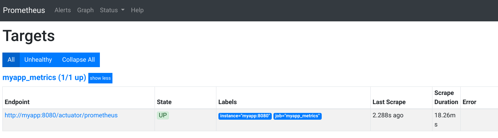
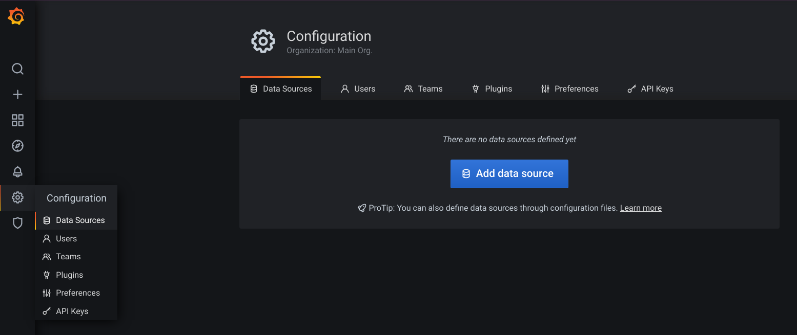
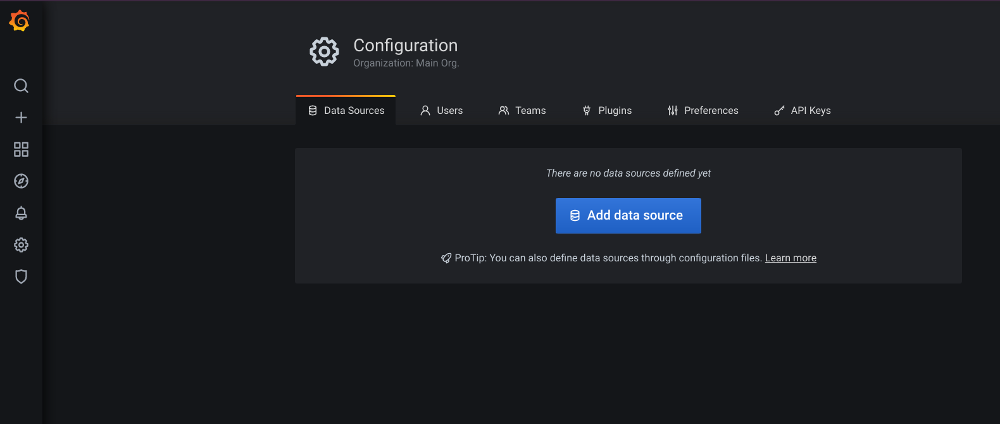
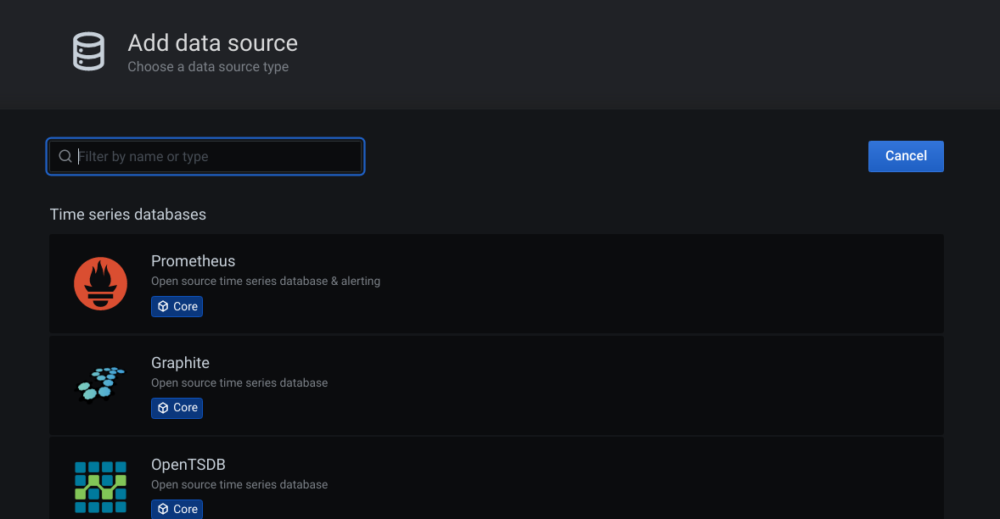
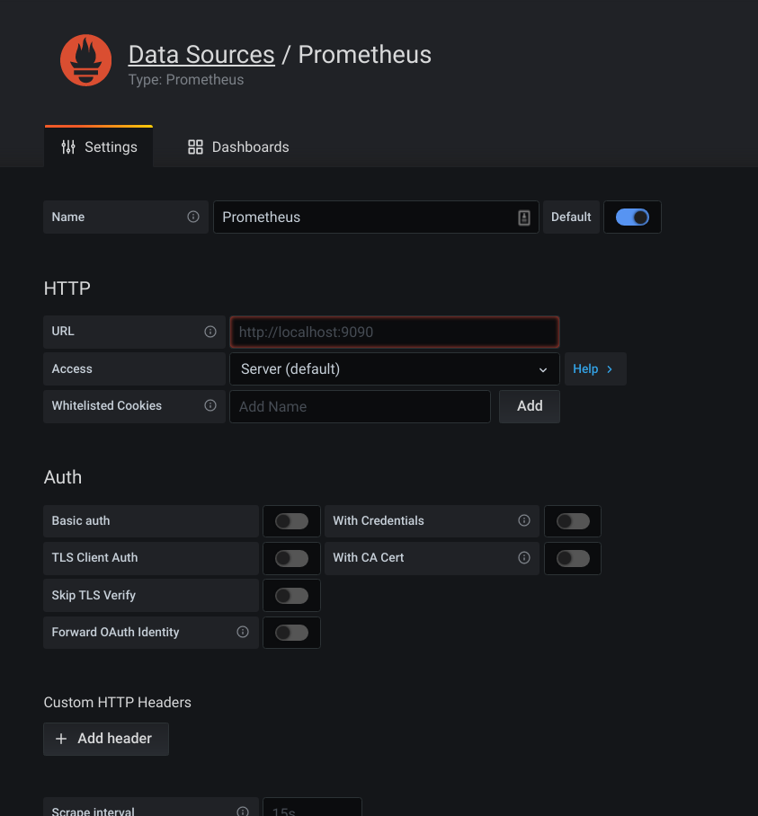
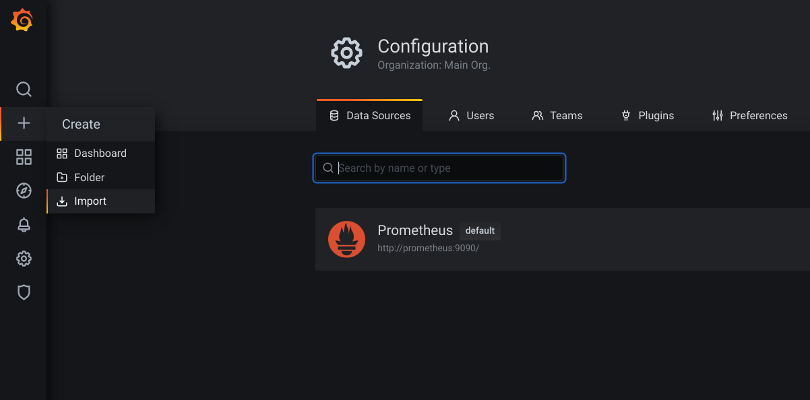
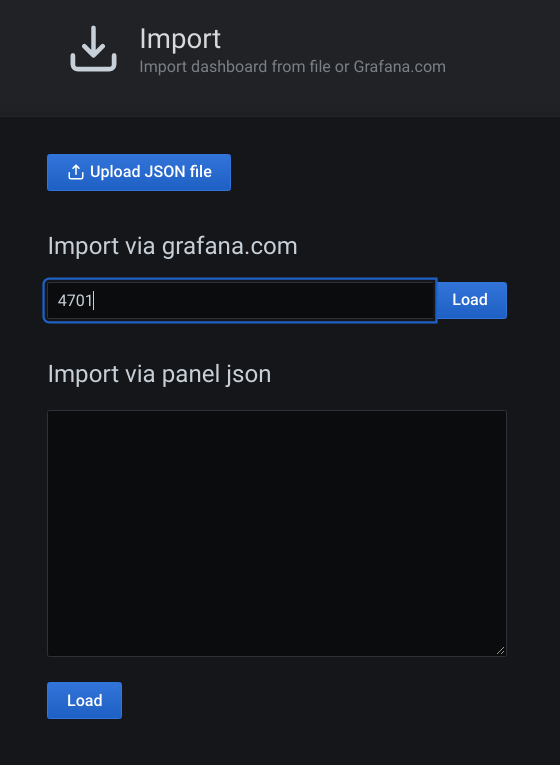
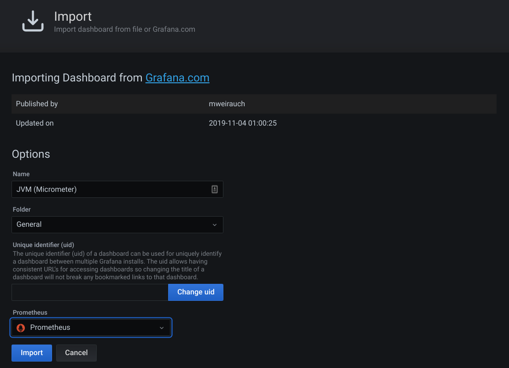

## Handra

### [Home](/) | Blog | [Disclaimer](/disclaimer) | [Terms and conditions](/tnc)

[<<go back](..)

### Monitoring SpringBoot Application with Prometheus and Grafana
In this post, we are going to learn on how can we monitor an application developed using SpringBoot framework using Prometheus and Grafana. We will deploy all the components using docker for simplicity. We will start the blog with simple, non-exhaustive, introduction on the components that we're going to use for this post. I'll provide links as well to where you can go to get more information on the related component.

---
#### Background
Monitoring is undeniably one of the important items to have when dealing with applications. It has become even more prevalent in the age of microservices, whereby the team needs to have visibility on what is going on with the multitude of microservices they are operating.

---
#### SpringBoot
SpringBoot is a framework developed by Pivotal that makes development of microservices become so much easier. It has multitude of support libraries that can ease the life of the developers in doing application development. SpringBoot takes an opinionated view of the Spring platform and third-party libraries to let developers start their work easily.

Below are some of the features of SpringBoot as grabbed from its website <https://spring.io/projects/spring-boot>:
- Create stand-alone Spring applications.
- Embed Tomcat, Jetty, or Undertow directly (no need to deploy WAR files).
- Provide opinionated 'starter" dependencies to simplify your build configuration.
- Automatically configure Spring and 3rd party libraries whenever possible.
- Provide production-ready features such as metrics, health checks, and externalised configuration.
- Absolutely no code generation and no requirement for XML configuration.

---
#### Prometheus
Prometheus is an open-source system monitoring and alerting toolkit. This tool was built previously at SoundCloud. Prometheus joined the Cloud Native Computing Foundation in 2016 as the second hosted project, after Kubernetes.

Below are some of the Prometheus features that can be exploited:
- A multi-dimensional data model with time series data identified by metric name and key/value pairs.
- PromQL, a flexible query language to leverage this dimentionality.
- No reliance on distributed storage; single server nodes are autonomous.
- Time series collection happens via a pull model over HTTP.
- Pushing time series is supported via an intermediary gateway.
- Targets are discovered via service discovery or static configuration.
- Multiple modes of graphing and dashboarding support.

To learn more on Prometheus, feel free to go to its website at <https://prometheus.io/>.

---
#### Grafana
Grafana is an open-source visualisation software that allows administrators to gain insight and to make-sense of the gathered data using beautiful charts and graphs. Grafana supports multiple data-sources. As you might have already guessed, Prometheus is one of the many supported data-sources.

Grafana has a number of dashboard selections that can be imported to help getting-up with Grafana faster. From <https://grafana.com/grafana/dashboards> you can find plethora of user-contributed dashboard that we can simply import and use, of course provided we have the correct data-sources configured.

To learn more on Grafana, feel free to go to its website at <https://grafana.com/>.

---
#### Develop the SpringBoot Application
Now that we should have a brief understanding on SpringBoot, Prometheus, and Grafana, let's start the discussion by creating our SpringBoot application. For simplicity purpose, we are not going to build a full-fledged SpringBoot application with multitude of functionalities. It should be enough though for the sole purpose of showing the application monitoring using Grafana.

Let's start by creating a SpringBoot application with Spring Starter Web and Spring Starter Actuator as its dependency. For this demo, I'll be using Gradle and Kotlin.

##### Adding dependency
For us to have metrics that can be exported and directly recognised by Prometheus, we will be using Micrometer. To use it, we can simply add the ```micrometer-registry-prometheus``` dependency into our project. This can be accessed directly from Maven repository here <https://mvnrepository.com/artifact/io.micrometer/micrometer-registry-prometheus>.

Here is the final dependency that I have inside my Gradle configuration.
```groovy
dependencies {
    implementation("io.micrometer:micrometer-registry-prometheus:1.5.5")
    implementation("org.springframework.boot:spring-boot-starter-actuator")
    implementation("org.springframework.boot:spring-boot-starter-web")
    implementation("com.fasterxml.jackson.module:jackson-module-kotlin")
    implementation("org.jetbrains.kotlin:kotlin-reflect")
    implementation("org.jetbrains.kotlin:kotlin-stdlib-jdk8")
    testImplementation("org.springframework.boot:spring-boot-starter-test") {
        exclude(group = "org.junit.vintage", module = "junit-vintage-engine")
    }
}
```

##### Creating a REST API
Now that we have the dependency set-up, let's start by creating a new RESTful API. This will be just a simple endpoint that will greet the API caller with a message *Hello <name>. Greetings for monitoring*. It is a very simple class as below.
```kotlin
import org.springframework.web.bind.annotation.GetMapping
import org.springframework.web.bind.annotation.PathVariable
import org.springframework.web.bind.annotation.RestController

@RestController
class HelloController {

    @GetMapping("/hello/{name}")
    fun sayHello(@PathVariable("name") name: String): String = "Hello $name. Greetings for monitoring."
}
```

Now, once the application is started and running, let's test it by calling the endpoint and a name. You should get the expected output.
```bash
handra@nebula  ~  curl http://localhost:8080/hello/handra
Hello handra. Greetings for monitoring.
```

##### Enabling the Prometheus metrics endpoint
By default, the prometheus metrics exposure via web is not enabled. To enable it, we need to expose it by putting a configuration inside our application.properties file. The configuration is ```management.endpoints.web.exposure.include```.
```properties
management.endpoints.web.exposure.include=prometheus
```

Now, when accessing the endpoint <http://localhost:8080/actuator/prometheus>, you should be able to get the metrics similar as below.
```bash
handra@nebula  ~  curl http://localhost:8080/actuator/prometheus
# HELP process_files_open_files The open file descriptor count
# TYPE process_files_open_files gauge
process_files_open_files 68.0
# HELP jvm_gc_memory_allocated_bytes_total Incremented for an increase in the size of the young generation memory pool after one GC to before the next
# TYPE jvm_gc_memory_allocated_bytes_total counter
jvm_gc_memory_allocated_bytes_total 0.0
# HELP tomcat_sessions_rejected_sessions_total  
# TYPE tomcat_sessions_rejected_sessions_total counter
tomcat_sessions_rejected_sessions_total 0.0
# HELP tomcat_sessions_active_max_sessions  
# TYPE tomcat_sessions_active_max_sessions gauge
tomcat_sessions_active_max_sessions 0.0
# HELP system_cpu_usage The "recent cpu usage" for the whole system
# TYPE system_cpu_usage gauge
system_cpu_usage -1.0
# HELP process_cpu_usage The "recent cpu usage" for the Java Virtual Machine process
# TYPE process_cpu_usage gauge
process_cpu_usage -1.0
# HELP jvm_gc_pause_seconds Time spent in GC pause
# TYPE jvm_gc_pause_seconds summary
jvm_gc_pause_seconds_count{action="end of minor GC",cause="collect due to normal GC activity",} 13.0
jvm_gc_pause_seconds_sum{action="end of minor GC",cause="collect due to normal GC activity",} 0.022
jvm_gc_pause_seconds_count{action="end of major GC",cause="collect due to normal GC activity",} 1.0
jvm_gc_pause_seconds_sum{action="end of major GC",cause="collect due to normal GC activity",} 0.004
# HELP jvm_gc_pause_seconds_max Time spent in GC pause
# TYPE jvm_gc_pause_seconds_max gauge
jvm_gc_pause_seconds_max{action="end of minor GC",cause="collect due to normal GC activity",} 0.0
jvm_gc_pause_seconds_max{action="end of major GC",cause="collect due to normal GC activity",} 0.0
# HELP jvm_classes_unloaded_classes_total The total number of classes unloaded since the Java virtual machine has started execution
# TYPE jvm_classes_unloaded_classes_total counter
jvm_classes_unloaded_classes_total 0.0
# HELP jvm_classes_loaded_classes The number of classes that are currently loaded in the Java virtual machine
# TYPE jvm_classes_loaded_classes gauge
jvm_classes_loaded_classes 7897.0
# HELP jvm_threads_live_threads The current number of live threads including both daemon and non-daemon threads
# TYPE jvm_threads_live_threads gauge
jvm_threads_live_threads 45.0
# HELP jvm_buffer_total_capacity_bytes An estimate of the total capacity of the buffers in this pool
# TYPE jvm_buffer_total_capacity_bytes gauge
jvm_buffer_total_capacity_bytes{id="direct",} 32816.0
jvm_buffer_total_capacity_bytes{id="mapped",} 0.0
# HELP jvm_memory_committed_bytes The amount of memory in bytes that is committed for the Java virtual machine to use
# TYPE jvm_memory_committed_bytes gauge
jvm_memory_committed_bytes{area="nonheap",id="miscellaneous non-heap storage",} 3.32066812E8
jvm_memory_committed_bytes{area="nonheap",id="class storage",} 3.3998964E8
jvm_memory_committed_bytes{area="nonheap",id="JIT code cache",} 2.68435456E8
jvm_memory_committed_bytes{area="heap",id="tenured-LOA",} 1042432.0
jvm_memory_committed_bytes{area="nonheap",id="JIT data cache",} 8388608.0
jvm_memory_committed_bytes{area="heap",id="nursery-survivor",} 1507328.0
jvm_memory_committed_bytes{area="heap",id="nursery-allocate",} 4390912.0
jvm_memory_committed_bytes{area="heap",id="tenured-SOA",} 1.9798016E7
# HELP tomcat_sessions_active_current_sessions  
# TYPE tomcat_sessions_active_current_sessions gauge
tomcat_sessions_active_current_sessions 0.0
# HELP jvm_gc_memory_promoted_bytes_total Count of positive increases in the size of the old generation memory pool before GC to after GC
# TYPE jvm_gc_memory_promoted_bytes_total counter
jvm_gc_memory_promoted_bytes_total 0.0
# HELP jvm_memory_max_bytes The maximum amount of memory in bytes that can be used for memory management
# TYPE jvm_memory_max_bytes gauge
jvm_memory_max_bytes{area="nonheap",id="miscellaneous non-heap storage",} -1.0
jvm_memory_max_bytes{area="nonheap",id="class storage",} -1.0
jvm_memory_max_bytes{area="nonheap",id="JIT code cache",} 2.68435456E8
jvm_memory_max_bytes{area="heap",id="tenured-LOA",} 2.04537856E8
jvm_memory_max_bytes{area="nonheap",id="JIT data cache",} 4.02653184E8
jvm_memory_max_bytes{area="heap",id="nursery-survivor",} 2.61470208E8
jvm_memory_max_bytes{area="heap",id="nursery-allocate",} 7.61677824E8
jvm_memory_max_bytes{area="heap",id="tenured-SOA",} 3.886219264E9
# HELP jvm_threads_daemon_threads The current number of live daemon threads
# TYPE jvm_threads_daemon_threads gauge
jvm_threads_daemon_threads 41.0
# HELP tomcat_sessions_alive_max_seconds  
# TYPE tomcat_sessions_alive_max_seconds gauge
tomcat_sessions_alive_max_seconds 0.0
# HELP jvm_memory_used_bytes The amount of used memory
# TYPE jvm_memory_used_bytes gauge
jvm_memory_used_bytes{area="nonheap",id="miscellaneous non-heap storage",} 2.9871356E7
jvm_memory_used_bytes{area="nonheap",id="class storage",} 3.7312312E7
jvm_memory_used_bytes{area="nonheap",id="JIT code cache",} 4369584.0
jvm_memory_used_bytes{area="heap",id="tenured-LOA",} 0.0
jvm_memory_used_bytes{area="nonheap",id="JIT data cache",} 6291528.0
jvm_memory_used_bytes{area="heap",id="nursery-survivor",} 1507328.0
jvm_memory_used_bytes{area="heap",id="nursery-allocate",} 4126520.0
jvm_memory_used_bytes{area="heap",id="tenured-SOA",} 1.5987544E7
# HELP jvm_gc_max_data_size_bytes Max size of old generation memory pool
# TYPE jvm_gc_max_data_size_bytes gauge
jvm_gc_max_data_size_bytes 0.0
# HELP jvm_gc_live_data_size_bytes Size of old generation memory pool after a full GC
# TYPE jvm_gc_live_data_size_bytes gauge
jvm_gc_live_data_size_bytes 0.0
# HELP logback_events_total Number of error level events that made it to the logs
# TYPE logback_events_total counter
logback_events_total{level="warn",} 0.0
logback_events_total{level="debug",} 0.0
logback_events_total{level="error",} 0.0
logback_events_total{level="trace",} 0.0
logback_events_total{level="info",} 7.0
# HELP process_start_time_seconds Start time of the process since unix epoch.
# TYPE process_start_time_seconds gauge
process_start_time_seconds 1.603509806678E9
# HELP tomcat_sessions_expired_sessions_total  
# TYPE tomcat_sessions_expired_sessions_total counter
tomcat_sessions_expired_sessions_total 0.0
# HELP process_uptime_seconds The uptime of the Java virtual machine
# TYPE process_uptime_seconds gauge
process_uptime_seconds 392.943
# HELP jvm_threads_peak_threads The peak live thread count since the Java virtual machine started or peak was reset
# TYPE jvm_threads_peak_threads gauge
jvm_threads_peak_threads 45.0
# HELP jvm_buffer_count_buffers An estimate of the number of buffers in the pool
# TYPE jvm_buffer_count_buffers gauge
jvm_buffer_count_buffers{id="direct",} 10.0
jvm_buffer_count_buffers{id="mapped",} 0.0
# HELP system_cpu_count The number of processors available to the Java virtual machine
# TYPE system_cpu_count gauge
system_cpu_count 12.0
# HELP jvm_threads_states_threads The current number of threads having NEW state
# TYPE jvm_threads_states_threads gauge
jvm_threads_states_threads{state="runnable",} 31.0
jvm_threads_states_threads{state="blocked",} 0.0
jvm_threads_states_threads{state="waiting",} 10.0
jvm_threads_states_threads{state="timed-waiting",} 4.0
jvm_threads_states_threads{state="new",} 0.0
jvm_threads_states_threads{state="terminated",} 0.0
# HELP system_load_average_1m The sum of the number of runnable entities queued to available processors and the number of runnable entities running on the available processors averaged over a period of time
# TYPE system_load_average_1m gauge
system_load_average_1m 5.57
# HELP http_server_requests_seconds  
# TYPE http_server_requests_seconds summary
http_server_requests_seconds_count{exception="None",method="GET",outcome="SUCCESS",status="200",uri="/hello/{name}",} 2.0
http_server_requests_seconds_sum{exception="None",method="GET",outcome="SUCCESS",status="200",uri="/hello/{name}",} 0.052343476
# HELP http_server_requests_seconds_max  
# TYPE http_server_requests_seconds_max gauge
http_server_requests_seconds_max{exception="None",method="GET",outcome="SUCCESS",status="200",uri="/hello/{name}",} 0.0
# HELP jvm_buffer_memory_used_bytes An estimate of the memory that the Java virtual machine is using for this buffer pool
# TYPE jvm_buffer_memory_used_bytes gauge
jvm_buffer_memory_used_bytes{id="direct",} 32816.0
jvm_buffer_memory_used_bytes{id="mapped",} 0.0
# HELP process_files_max_files The maximum file descriptor count
# TYPE process_files_max_files gauge
process_files_max_files 1048576.0
# HELP tomcat_sessions_created_sessions_total  
# TYPE tomcat_sessions_created_sessions_total counter
tomcat_sessions_created_sessions_total 0.0
```

As you can see, it's very simple. Just by adding a dependency and a simple configuration, you are now having the metrics data that is recognised by Prometheus.

Now the our application is ready, let's build our application using Gradle.
```bash
gradle bootJar
```

This will create an executable JAR file inside the ```build/libs/``` folder.
```bash
handra@nebula  /media/handra/DATA/IdeaProjects/DemoMetrics  ll ./build/libs 
total 23M
-rwxrwxrwx 1 handra handra 23M Oct 24 12:21 demometrics-0.0.1-SNAPSHOT.jar
```

---
#### Create docker image for our application
Now that we have our application ready, let's create our implementation using Docker.

Below is the docker file for our SpringBoot application.
```docker
FROM adoptopenjdk/openjdk11-openj9
WORKDIR /app
COPY build/libs/demometrics-0.0.1-SNAPSHOT.jar /app/app.jar
EXPOSE 8080
CMD ["java", "-jar", "app.jar"]
```

Now, let's build the docker image using the following command.
```bash
docker build -t myapp .
```

It will create a docker image with name ```myapp```.
```bash
handra@nebula  /media/handra/DATA/IdeaProjects/DemoMetrics  docker images myapp
REPOSITORY          TAG                 IMAGE ID            CREATED             SIZE
myapp               latest              30ccb0aad5a4        20 minutes ago      468MB
```

---
##### Create docker compose
Now that we have our application image ready, it is time for us to create all the necessary services for this post. As mentioned above, we will be monitoring our application using Prometheus and Grafana. Hence, we will need to have THREE (3) services: ```myapp```, ```prometheus```, and ```grafana```.

We will create a new file named ```docker-compose.yml``` with the following content:
```docker
version: "3"
services:
    myapp:
        image: myapp:latest
        ports:
            - "8080:8080"
        hostname: myapp

    prometheus:
        image: prom/prometheus
        ports:
            - "9090:9090"
        volumes:
            - ./prometheus.yml:/etc/prometheus/prometheus.yml
        hostname: prometheus

    grafana:
        image: grafana/grafana
        depends_on:
            - prometheus
        ports:
            - "3000:3000"
        hostname: grafana
```

We will as well create another file named ```prometheus.yml```. This file contains the configuration that will be read by Prometheus. We will put the information on where to scrap the ```myapp``` metrics inside this file. Here is the content of the file.
```yaml
# my global config
global:
    scrape_interval:     5s # Set the scrape interval to every 5 seconds. Default is every 1 minute.
    evaluation_interval: 5s # Evaluate rules every 5 seconds. The default is every 1 minute.
    # scrape_timeout is set to the global default (10s).

# A scrape configuration containing exactly one endpoint to scrape:
# Here it's Prometheus itself.
scrape_configs:
    # The job name is added as a label `job=<job_name>` to any timeseries scraped from this config.
    - job_name: 'myapp_metrics'
      metrics_path: '/actuator/prometheus'
      static_configs:
          - targets: ['myapp:8080']
```

To bring up the services, we can use the command ```docker-compose up -d```. Note that if you don't have docker image for ```prometheus``` and ```grafana``` in your local, it will download from the internet. Below is the output for the given command.
```bash
handra@nebula  /media/handra/DATA/IdeaProjects/DemoMetrics  docker-compose up -d
Creating network "demometrics_default" with the default driver
Creating demometrics_myapp_1      ... done
Creating demometrics_prometheus_1 ... done
Creating demometrics_grafana_1    ... done
```

To check that all the services are running, we can issue command ```docker ps```.
```bash
handra@nebula  /media/handra/DATA/IdeaProjects/DemoMetrics  docker ps
CONTAINER ID        IMAGE               COMMAND                  CREATED             STATUS              PORTS                    NAMES
784df561e42b        grafana/grafana     "/run.sh"                48 seconds ago      Up 47 seconds       0.0.0.0:3000->3000/tcp   demometrics_grafana_1
d66c4bb2d8d9        prom/prometheus     "/bin/prometheus --c…"   48 seconds ago      Up 47 seconds       0.0.0.0:9090->9090/tcp   demometrics_prometheus_1
10bc19f68201        myapp:latest        "java -jar app.jar"      48 seconds ago      Up 47 seconds       0.0.0.0:8080->8080/tcp   demometrics_myapp_1
```
---
##### Verifying Prometheus targets
Now that we have all the services up and running, let's ensure that Prometheus has successfully scraped metrics data from ```myapp``` as configured inside the ```prometheus.yml```.

Let's open a web browser and go to <http://localhost:9090/targets>. It should show that the endpoint for ```myapp_metrics``` is *UP*.



---
##### Configure Grafana
Once we ensure that Prometheus able to scrap our application's metrics, let's proceed to configure Grafana. Let's access Grafana by going to <http://localhost:3000>. You will be asked to login. You can provide the default username password which is ```admin``` and ```admin``` respectively.


If this is your first time login, you will be asked to change the password. Once logged-in, go to the data source to add Prometheus as one of the data sources.

###### Grafana Data Source


Click on the **Add data source** button.


Click on the **Prometheus**.




Here, you will be presented with a set of inputs to fill-in. For now, we just need to worry about the URL. Let's put <http://localhost:9090/> into the URL field.


After that, click on the **Save & Test** button (blue colour button) at the bottom of the form.


When the data-source testing is OK, you will be presented with a message saying **_Data source is working_**.


###### Grafana Import Dashboard
Once we have the data source configured properly, we can import/load a dashboard into the Grafana. We will use the **JVM (Micrometer)** dashboard that is available online with code **4701**.



Let's go to *Import* dashboard in Grafana.




A new page will be loaded. Let's enter number *4701* and click on the **Load** button next to it.




Once loaded, Grafana will show the details of this Dashboard. Note that you have to choose the correct **Prometheus** data source at the **Prometheus** drop-down list. Once done, click on the **Import** button. A dashboard page will be shown.


This dashboard shows you the details of the JVM, including the HTTP metrics.

Now, you can try sending a lot of requests to the ```myapp``` and refresh (or wait for the dashboard to refresh). Once the metrics is gathered, Grafana will update the dashboard, especially on the **I/O Overview** and some other JVM details, such as **Load** and **Threads**. This way, we can monitor the health of our service and act accordingly when we notice something is not quite right.

You can use the **ab** command to send loads of requests to the server, such as the following.
```bash
handra@nebula  /media/handra/DATA/IdeaProjects/DemoMetrics  ab -n 500000 -c 50 http://localhost:8080/hello/handra 
This is ApacheBench, Version 2.3 <$Revision: 1879490 $>
Copyright 1996 Adam Twiss, Zeus Technology Ltd, http://www.zeustech.net/
Licensed to The Apache Software Foundation, http://www.apache.org/

Benchmarking localhost (be patient)
Completed 50000 requests
Completed 100000 requests
Completed 150000 requests
Completed 200000 requests
Completed 250000 requests
Completed 300000 requests
Completed 350000 requests
Completed 400000 requests
Completed 450000 requests
Completed 500000 requests
Finished 500000 requests


Server Software:        
Server Hostname:        localhost
Server Port:            8080

Document Path:          /hello/handra
Document Length:        39 bytes

Concurrency Level:      50
Time taken for tests:   53.476 seconds
Complete requests:      500000
Failed requests:        0
Total transferred:      86000000 bytes
HTML transferred:       19500000 bytes
Requests per second:    9349.93 [#/sec] (mean)
Time per request:       5.348 [ms] (mean)
Time per request:       0.107 [ms] (mean, across all concurrent requests)
Transfer rate:          1570.50 [Kbytes/sec] received

Connection Times (ms)
              min  mean[+/-sd] median   max
Connect:        0    1   0.7      1      15
Processing:     0    4   2.1      4      42
Waiting:        0    4   1.8      3      40
Total:          1    5   2.0      5      45

Percentage of the requests served within a certain time (ms)
  50%      5
  66%      5
  75%      6
  80%      6
  90%      8
  95%      9
  98%     11
  99%     12
 100%     45 (longest request)
```

---
That's all. This might look like a lot of steps at first, however once you get the hang of it, the steps are very straight-forward.

I hope this is helpful and the source code (including the docker related files) for this is available at Github [here](https://github.com/handracs2007/bootgrafana){:target=_blank}.

Cheers

---

> Copyright &copy; 2020-2024 Handra. All Rights Reserved.