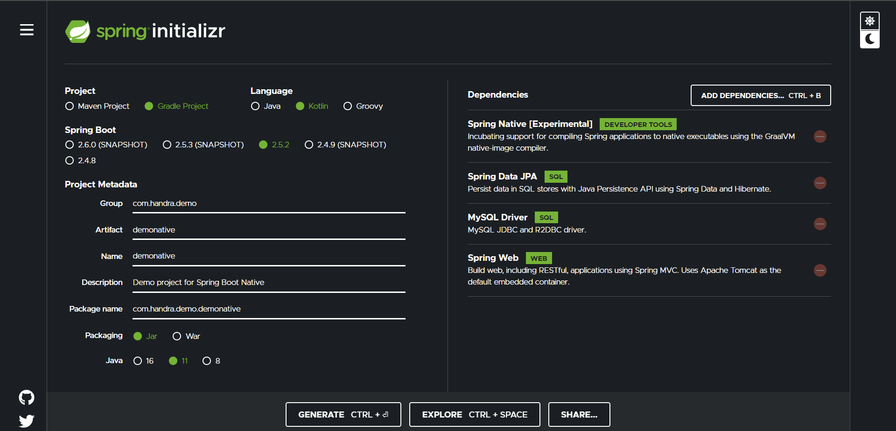
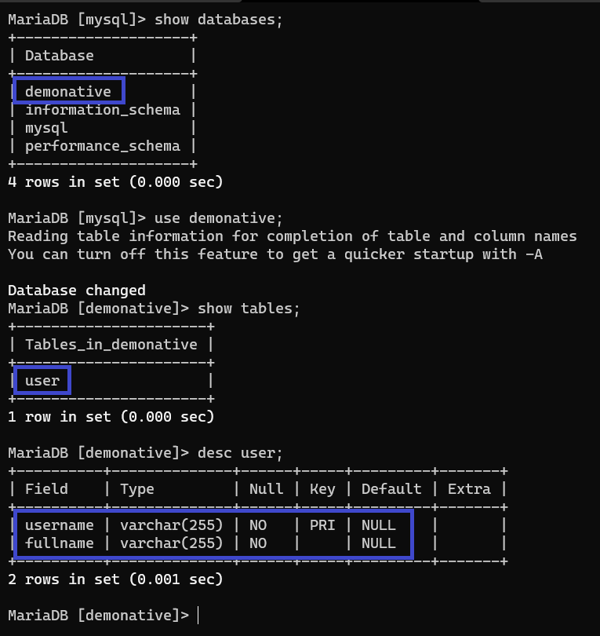
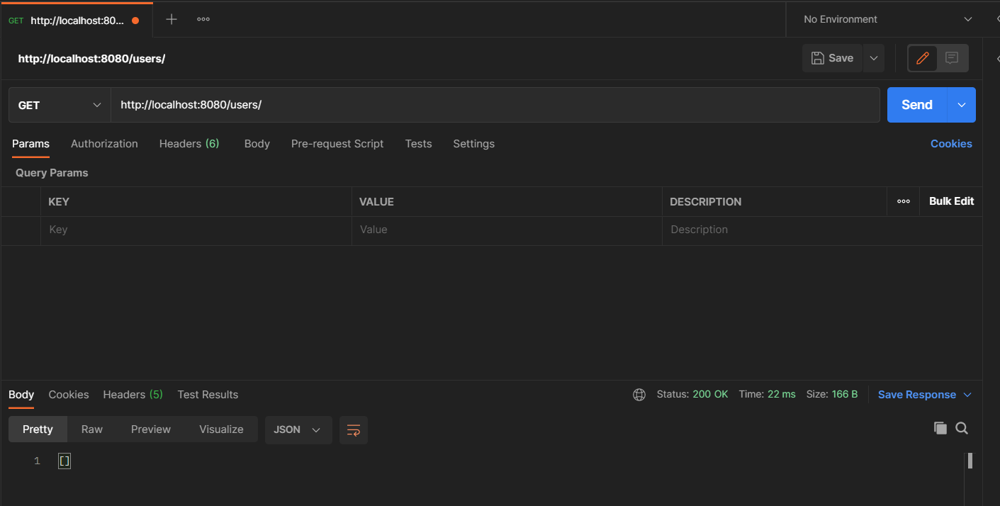
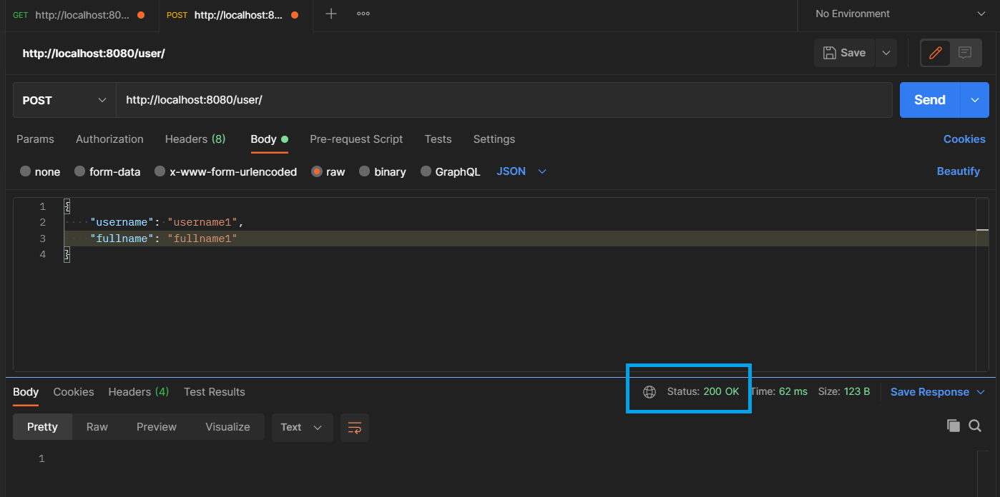
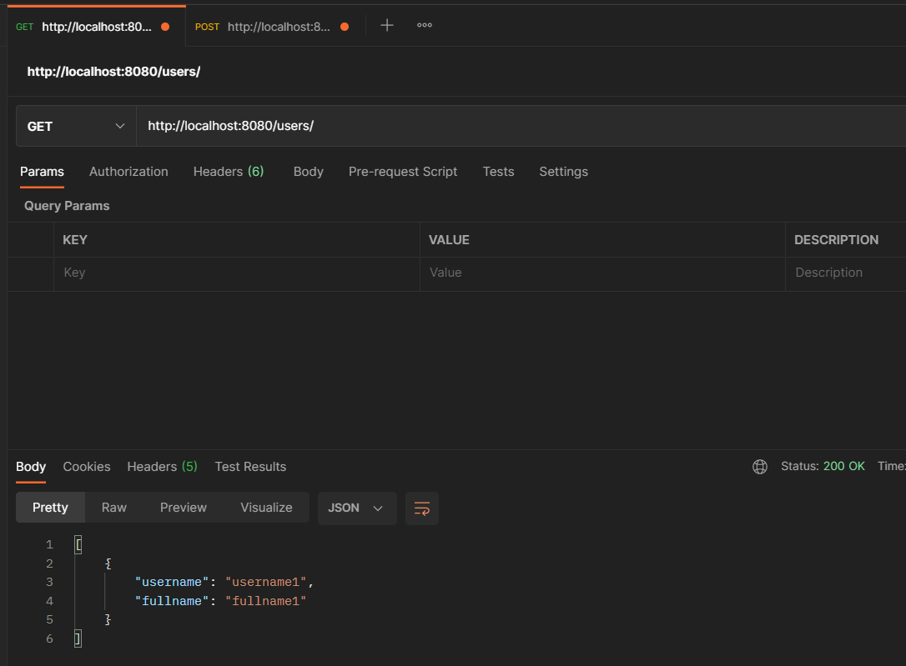
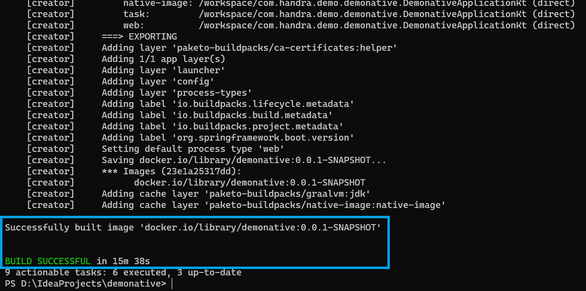
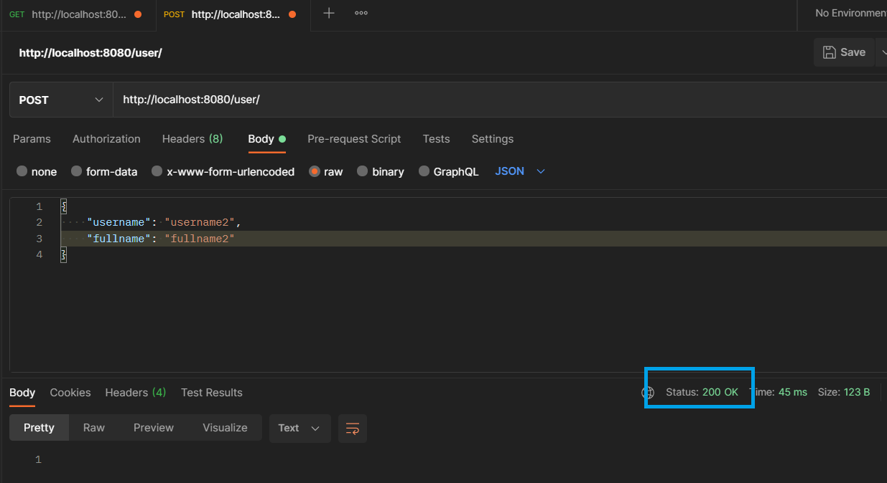
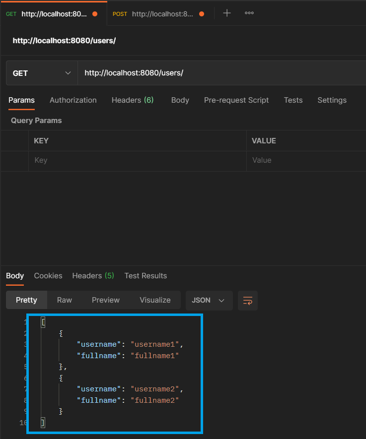

## Handra

### [Home](/) | Blog | [Disclaimer](/disclaimer) | [Terms and conditions](/tnc)

[<<go back](..)

### Native Application with Spring Native and JPA
In this post, we are going to run through a step by step approach on creating a containerised native Spring Boot application. It is assumed that you already have basic familiarity with Spring Boot. We are going to use Gradle as the build system and Kotlin as the programming language. As of the time this post is written, latest Spring Boot version is 2.5.2, hence the version we are using here.

---
#### Background
Cloud native has been quite a buzz-word lately. More and more people and organisations are realising the importance of having applications deployed in a container suitable for cloud environment. Spring as one of the early Java framework realises this and come up with [Spring Boot project](https://spring.io/projects/spring-boot#overview){:target=_blank}. Spring Boot makes it easy to create stand-alone, production-grade Spring based Applications that you can "just run". Spring team takes an opinionated view of the Spring platform and third-party libraries so you can get started with minimum fuss. Most Spring Boot applications need minimal Spring configuration.

As part of the cloud native initiatives, people can hardly run away from microservice architecture. Microservice architectures are like the ‘new normal’. Building small, self-contained, ready to run applications can bring great flexibility and added resilience to the code. Spring Boot can help here by providing many purpose-built features to make it easy to build and run microservices in production at scale.

Java ecosystem has had a huge improvements lately, especially on the JVM. With new garbage collector that provides faster and more predictable pause time, including JIT (Just In-time Compilation), we can have a better performant Java applications. Whilst Java applications by itself is not bad, sometimes there is a need to have a faster start-up time and lower memory footprint for our applications, especially when we are deploying it on the cloud where containers are shutdown and brought-up on demand and automatically. This is where the idea of compiling Java based applications to native executable comes to the fruition.

---
#### Here Comes Spring Native
Taken from the Spring website, Spring Native provides support for compiling Spring applications to native executables using the GraalVM native-image compiler. Compared to the Java Virtual Machine, native images can enable cheaper and more sustainable hosting for many types of workloads. These include microservices, function workloads, well suited to containers, and Kubernetes

Using native image provides key advantages, such as instant startup, instant peak performance, and reduced memory consumption. There are also some drawbacks and trade-offs that the GraalVM native project expect to improve on over time. Building a native image is a heavy process that is slower than a regular application. A native image has fewer runtime optimizations after warmup. Finally, it is less mature than the JVM with some different behaviors.

The goal of the Spring Native is to be an alternative to Spring JVM, and provide a native deployment option designed to be packaged in lightweight containers. In practice, the target is to support Spring applications, almost unmodified, on this new platform. Learn more about [Spring Native project](https://docs.spring.io/spring-native/docs/current/reference/htmlsingle/){:target=_blank} from its website.

---
### Getting Started
For this demo application, I will be using MariaDB as its backend database. I am using Docker to run the MariaDB. Since I'm on Windows, I'm using Docker Desktop. If you do not have Docker installed in your environment, please follow the installation guide specific for your environment.

#### Installing MariaDB
First of all, let's download the MariaDB docker container. You may skip this step if you already have MariaDB docker container in your environment. Execute the command `docker pull mariadb` to download the MariaDB docker container.
<pre>
PS C:\Users\Handra> docker pull mariadb
Using default tag: latest
latest: Pulling from library/mariadb
c549ccf8d472: Pull complete
26ea6552a462: Pull complete
329b1f41043f: Pull complete
9f8d09317d80: Pull complete
2bc055a5511d: Pull complete
e989e430508e: Pull complete
cdba2af19f87: Pull complete
04fe4f90eab8: Pull complete
389c6b423e31: Pull complete
bef640655d86: Pull complete
Digest: sha256:0c72b63198ac53df4e84db821876c73794b00509b2d8a77100d186a13e49ac31
Status: Downloaded newer image for mariadb:latest
docker.io/library/mariadb:latest
</pre>

By issuing `docker images` command, you should be able to see that the `mariadb` container is heter.
<pre>
PS C:\Users\Handra> docker images
REPOSITORY   TAG       IMAGE ID       CREATED       SIZE
mariadb      latest    6d5c5ed114ad   2 weeks ago   408MB
</pre>

#### Running MariaDB
Now that we have the MariaDB installed in our Docker, let's run it using `docker run -e MARIADB_ROOT_PASSWORD=foo123 --rm --name mariadb -p3306:3306 mariadb`. Using this command, you should have a MariaDB server running in your workstation listening at port 3306. The `root` password is `foo123` (obviously don't do it in production) as specified in the command. You may change it to something else based on your needs.

You should see output like below:
<pre>
PS C:\Users\Handra> docker run -e MARIADB_ROOT_PASSWORD=foo123 --rm --name mariadb -p3306:3306 mariadb
2021-07-11 03:45:35+00:00 [Note] [Entrypoint]: Entrypoint script for MariaDB Server 1:10.5.11+maria~focal started.
2021-07-11 03:45:35+00:00 [Note] [Entrypoint]: Switching to dedicated user 'mysql'
2021-07-11 03:45:35+00:00 [Note] [Entrypoint]: Entrypoint script for MariaDB Server 1:10.5.11+maria~focal started.
2021-07-11 03:45:35+00:00 [Note] [Entrypoint]: Initializing database files


PLEASE REMEMBER TO SET A PASSWORD FOR THE MariaDB root USER !
To do so, start the server, then issue the following commands:

'/usr/bin/mysqladmin' -u root password 'new-password'
'/usr/bin/mysqladmin' -u root -h  password 'new-password'

Alternatively you can run:
'/usr/bin/mysql_secure_installation'

which will also give you the option of removing the test
databases and anonymous user created by default.  This is
strongly recommended for production servers.

See the MariaDB Knowledgebase at https://mariadb.com/kb or the
MySQL manual for more instructions.

Please report any problems at https://mariadb.org/jira

The latest information about MariaDB is available at https://mariadb.org/.
You can find additional information about the MySQL part at:
https://dev.mysql.com
Consider joining MariaDB's strong and vibrant community:
https://mariadb.org/get-involved/

2021-07-11 03:45:36+00:00 [Note] [Entrypoint]: Database files initialized
2021-07-11 03:45:36+00:00 [Note] [Entrypoint]: Starting temporary server
2021-07-11 03:45:36+00:00 [Note] [Entrypoint]: Waiting for server startup
2021-07-11  3:45:36 0 [Note] mysqld (mysqld 10.5.11-MariaDB-1:10.5.11+maria~focal) starting as process 119 ...
2021-07-11  3:45:36 0 [Note] InnoDB: Uses event mutexes
2021-07-11  3:45:36 0 [Note] InnoDB: Compressed tables use zlib 1.2.11
2021-07-11  3:45:36 0 [Note] InnoDB: Number of pools: 1
2021-07-11  3:45:36 0 [Note] InnoDB: Using crc32 + pclmulqdq instructions
2021-07-11  3:45:36 0 [Note] mysqld: O_TMPFILE is not supported on /tmp (disabling future attempts)
2021-07-11  3:45:36 0 [Note] InnoDB: Using Linux native AIO
2021-07-11  3:45:36 0 [Note] InnoDB: Initializing buffer pool, total size = 134217728, chunk size = 134217728
2021-07-11  3:45:36 0 [Note] InnoDB: Completed initialization of buffer pool
2021-07-11  3:45:36 0 [Note] InnoDB: 128 rollback segments are active.
2021-07-11  3:45:36 0 [Note] InnoDB: Creating shared tablespace for temporary tables
2021-07-11  3:45:36 0 [Note] InnoDB: Setting file './ibtmp1' size to 12 MB. Physically writing the file full; Please wait ...
2021-07-11  3:45:36 0 [Note] InnoDB: File './ibtmp1' size is now 12 MB.
2021-07-11  3:45:36 0 [Note] InnoDB: 10.5.11 started; log sequence number 45118; transaction id 20
2021-07-11  3:45:36 0 [Note] Plugin 'FEEDBACK' is disabled.
2021-07-11  3:45:36 0 [Note] InnoDB: Loading buffer pool(s) from /var/lib/mysql/ib_buffer_pool
2021-07-11  3:45:36 0 [Note] InnoDB: Buffer pool(s) load completed at 210711  3:45:36
2021-07-11  3:45:36 0 [Warning] 'user' entry 'root@2c3ef0f76bec' ignored in --skip-name-resolve mode.
2021-07-11  3:45:36 0 [Warning] 'proxies_priv' entry '@% root@2c3ef0f76bec' ignored in --skip-name-resolve mode.
2021-07-11  3:45:36 0 [Note] Reading of all Master_info entries succeeded
2021-07-11  3:45:36 0 [Note] Added new Master_info '' to hash table
2021-07-11  3:45:36 0 [Note] mysqld: ready for connections.
Version: '10.5.11-MariaDB-1:10.5.11+maria~focal'  socket: '/run/mysqld/mysqld.sock'  port: 0  mariadb.org binary distribution
2021-07-11 03:45:37+00:00 [Note] [Entrypoint]: Temporary server started.
Warning: Unable to load '/usr/share/zoneinfo/leap-seconds.list' as time zone. Skipping it.
Warning: Unable to load '/usr/share/zoneinfo/leapseconds' as time zone. Skipping it.
Warning: Unable to load '/usr/share/zoneinfo/tzdata.zi' as time zone. Skipping it.
2021-07-11  3:45:39 5 [Warning] 'proxies_priv' entry '@% root@2c3ef0f76bec' ignored in --skip-name-resolve mode.

2021-07-11 03:45:39+00:00 [Note] [Entrypoint]: Stopping temporary server
2021-07-11  3:45:39 0 [Note] mysqld (initiated by: root[root] @ localhost []): Normal shutdown
2021-07-11  3:45:39 0 [Note] Event Scheduler: Purging the queue. 0 events
2021-07-11  3:45:39 0 [Note] InnoDB: FTS optimize thread exiting.
2021-07-11  3:45:39 0 [Note] InnoDB: Starting shutdown...
2021-07-11  3:45:39 0 [Note] InnoDB: Dumping buffer pool(s) to /var/lib/mysql/ib_buffer_pool
2021-07-11  3:45:39 0 [Note] InnoDB: Buffer pool(s) dump completed at 210711  3:45:39
2021-07-11  3:45:39 0 [Note] InnoDB: Removed temporary tablespace data file: "ibtmp1"
2021-07-11  3:45:39 0 [Note] InnoDB: Shutdown completed; log sequence number 45130; transaction id 21
2021-07-11  3:45:39 0 [Note] mysqld: Shutdown complete

2021-07-11 03:45:40+00:00 [Note] [Entrypoint]: Temporary server stopped

2021-07-11 03:45:40+00:00 [Note] [Entrypoint]: MariaDB init process done. Ready for start up.

2021-07-11  3:45:40 0 [Note] mysqld (mysqld 10.5.11-MariaDB-1:10.5.11+maria~focal) starting as process 1 ...
2021-07-11  3:45:40 0 [Note] InnoDB: Uses event mutexes
2021-07-11  3:45:40 0 [Note] InnoDB: Compressed tables use zlib 1.2.11
2021-07-11  3:45:40 0 [Note] InnoDB: Number of pools: 1
2021-07-11  3:45:40 0 [Note] InnoDB: Using crc32 + pclmulqdq instructions
2021-07-11  3:45:40 0 [Note] mysqld: O_TMPFILE is not supported on /tmp (disabling future attempts)
2021-07-11  3:45:40 0 [Note] InnoDB: Using Linux native AIO
2021-07-11  3:45:40 0 [Note] InnoDB: Initializing buffer pool, total size = 134217728, chunk size = 134217728
2021-07-11  3:45:40 0 [Note] InnoDB: Completed initialization of buffer pool
2021-07-11  3:45:40 0 [Note] InnoDB: 128 rollback segments are active.
2021-07-11  3:45:40 0 [Note] InnoDB: Creating shared tablespace for temporary tables
2021-07-11  3:45:40 0 [Note] InnoDB: Setting file './ibtmp1' size to 12 MB. Physically writing the file full; Please wait ...
2021-07-11  3:45:40 0 [Note] InnoDB: File './ibtmp1' size is now 12 MB.
2021-07-11  3:45:40 0 [Note] InnoDB: 10.5.11 started; log sequence number 45130; transaction id 20
2021-07-11  3:45:40 0 [Note] InnoDB: Loading buffer pool(s) from /var/lib/mysql/ib_buffer_pool
2021-07-11  3:45:40 0 [Note] Plugin 'FEEDBACK' is disabled.
2021-07-11  3:45:40 0 [Note] InnoDB: Buffer pool(s) load completed at 210711  3:45:40
2021-07-11  3:45:40 0 [Note] Server socket created on IP: '::'.
2021-07-11  3:45:40 0 [Warning] 'proxies_priv' entry '@% root@2c3ef0f76bec' ignored in --skip-name-resolve mode.
2021-07-11  3:45:40 0 [Note] Reading of all Master_info entries succeeded
2021-07-11  3:45:40 0 [Note] Added new Master_info '' to hash table
2021-07-11  3:45:40 0 [Note] mysqld: ready for connections.
Version: '10.5.11-MariaDB-1:10.5.11+maria~focal'  socket: '/run/mysqld/mysqld.sock'  port: 3306  mariadb.org binary distribution
</pre>

#### Create Spring Boot Project
Now that we have the database server ready, let's create a new Spring Boot project by going to https://start.spring.io. The following screenshot gives a glimpse of the project details and dependencies.



As can be sent from the above screenshot, we need to have the following dependencies:
 - Spring Native (Experimental)
 - Spring Data JPA
 - MySQL Driver
 - Spring Web

As you can see, as of when this post is written, Spring Native is still in the experimental stage, so breaking changes might still happen in the future.

---
### Preparing Database
For this demo application, we are going to create just a simple `user` table containing `username` and `fullname`. We will name our database `demonative`.

```sql
CREATE DATABASE demonative;
USE demonative;

CREATE TABLE user (
    username VARCHAR(255) PRIMARY KEY,
    fullname VARCHAR(255) NOT NULL
);
```

After successfully executed the above script, you should now have `demonative` database with `user` table inside.


--- 

### Configuring Application to Connect
Now, let's open our `application.properties` file and put the following configuration.

```properties
spring.datasource.url=jdbc:mysql://mariadbserver:3306/demonative
spring.datasource.username=root
spring.datasource.password=foo123
```

The part `mariadbserver:3306` refers to the hostname and port where the MariaDB is running and listening on. If you are using different host and port, then you will want to adjust this parameter accordingly. Similary, if you are using different username and password, please adjust accordingly.

---
### Test Running our Application
Now, let's try to run our application. When everything is OK, our application should be up and running without any problem.

We can use command `.\gradlew.bat bootRun` on Windows or `./gradlew bootRun` on Unix environment.

<pre>
PS D:\IdeaProjects\demonative> .\gradlew.bat bootRun

> Task :generateAot
WARNING: Unable to find jar 'D:\IdeaProjects\demonative\build\classes\java\main' whilst scanning filesystem
Failed verification check: this type was requested to be added to configuration but is not resolvable: org.springframework.security.config.annotation.web.configuration.AutowiredWebSecurityConfigurersIgnoreParents it will be skipped
Failed verification check: this type was requested to be added to configuration but is not resolvable: io.netty.channel.socket.nio.NioSocketChannel it will be skipped
Failed verification check: this type was requested to be added to configuration but is not resolvable: org.springframework.boot.test.autoconfigure.jdbc.JdbcTest it will be skipped
Failed verification check: this type was requested to be added to configuration but is not resolvable: org.springframework.boot.test.autoconfigure.jdbc.JdbcTestContextBootstrapper it will be skipped
Failed verification check: this type was requested to be added to configuration but is not resolvable: org.springframework.boot.test.autoconfigure.jdbc.JdbcTypeExcludeFilter it will be skipped
Failed verification check: this type was requested to be added to configuration but is not resolvable: org.springframework.boot.test.autoconfigure.json.JsonTest it will be skipped
Failed verification check: this type was requested to be added to configuration but is not resolvable: org.springframework.boot.test.autoconfigure.json.JsonTestContextBootstrapper it will be skipped
Failed verification check: this type was requested to be added to configuration but is not resolvable: org.springframework.boot.test.autoconfigure.json.JsonTypeExcludeFilter it will be skipped
Failed verification check: this type was requested to be added to configuration but is not resolvable: org.springframework.boot.test.autoconfigure.orm.jpa.DataJpaTest it will be skipped
Failed verification check: this type was requested to be added to configuration but is not resolvable: org.springframework.boot.test.autoconfigure.orm.jpa.DataJpaTestContextBootstrapper it will be skipped
Failed verification check: this type was requested to be added to configuration but is not resolvable: org.springframework.boot.test.autoconfigure.orm.jpa.DataJpaTypeExcludeFilter it will be skipped
Failed verification check: this type was requested to be added to configuration but is not resolvable: org.springframework.boot.test.autoconfigure.web.servlet.WebMvcTest it will be skipped
Failed verification check: this type was requested to be added to configuration but is not resolvable: org.springframework.boot.test.autoconfigure.web.servlet.WebMvcTestContextBootstrapper it will be skipped
Failed verification check: this type was requested to be added to configuration but is not resolvable: org.springframework.boot.test.autoconfigure.web.servlet.WebMvcTypeExcludeFilter it will be skipped
Failed verification check: this type was requested to be added to configuration but is not resolvable: org.springframework.messaging.handler.annotation.MessageMapping it will be skipped
Failed verification check: this type was requested to be added to configuration but is not resolvable: org.springframework.boot.test.context.SpringBootTest$WebEnvironment it will be skipped
Failed verification check: this type was requested to be added to configuration but is not resolvable: org.springframework.test.context.junit.jupiter.SpringExtension it will be skipped
Failed verification check: this type was requested to be added to configuration but is not resolvable: org.springframework.test.context.cache.DefaultCacheAwareContextLoaderDelegate it will be skipped
Failed verification check: this type was requested to be added to configuration but is not resolvable: org.springframework.test.context.support.DefaultBootstrapContext it will be skipped
Failed verification check: this type was requested to be added to configuration but is not resolvable: org.springframework.boot.test.context.SpringBootTestContextBootstrapper it will be skipped
Failed verification check: this type was requested to be added to configuration but is not resolvable: org.springframework.boot.test.context.SpringBootContextLoader it will be skipped
Failed verification check: this type was requested to be added to configuration but is not resolvable: org.springframework.boot.test.autoconfigure.SpringBootDependencyInjectionTestExecutionListener it will be skipped
Failed verification check: this type was requested to be added to configuration but is not resolvable: org.springframework.boot.test.mock.mockito.MockitoPostProcessor it will be skipped
Failed verification check: this type was requested to be added to configuration but is not resolvable: org.springframework.boot.test.autoconfigure.OverrideAutoConfiguration it will be skipped
Failed verification check: this type was requested to be added to configuration but is not resolvable: org.springframework.boot.test.autoconfigure.filter.TypeExcludeFilters it will be skipped
Failed verification check: this type was requested to be added to configuration but is not resolvable: org.springframework.boot.test.context.SpringBootTest it will be skipped
Failed verification check: this type was requested to be added to configuration but is not resolvable: org.springframework.test.context.web.WebAppConfiguration it will be skipped
Failed verification check: this type was requested to be added to configuration but is not resolvable: org.springframework.test.context.BootstrapWith it will be skipped
Failed verification check: this type was requested to be added to configuration but is not resolvable: org.springframework.boot.test.autoconfigure.web.servlet.AutoConfigureMockMvc it will be skipped
Failed verification check: this type was requested to be added to configuration but is not resolvable: org.springframework.test.context.TestPropertySource it will be skipped
Failed verification check: this type was requested to be added to configuration but is not resolvable: org.springframework.web.reactive.socket.server.upgrade.TomcatRequestUpgradeStrategy it will be skipped

> Task :compileAotJava
warning: unknown enum constant When.MAYBE
  reason: class file for javax.annotation.meta.When not found
Note: Some input files use or override a deprecated API.
Note: Recompile with -Xlint:deprecation for details.
Note: D:\IdeaProjects\demonative\build\generated\sources\aot\org\springframework\aot\StaticSpringFactories.java uses unchecked or unsafe operations.
Note: Recompile with -Xlint:unchecked for details.
1 warning

> Task :bootRun

  .   ____          _            __ _ _
 /\\ / ___'_ __ _ _(_)_ __  __ _ \ \ \ \
( ( )\___ | '_ | '_| | '_ \/ _` | \ \ \ \
 \\/  ___)| |_)| | | | | || (_| |  ) ) ) )
  '  |____| .__|_| |_|_| |_\__, | / / / /
 =========|_|==============|___/=/_/_/_/
 :: Spring Boot ::                (v2.5.2)

2021-07-11 12:26:56.973  INFO 10248 --- [           main] c.h.d.d.DemonativeApplicationKt          : Starting DemonativeApplicationKt using Java 16.0.1 on SUPERNOVA with PID 10248 (D:\IdeaProjects\demonative\build\classes\kotlin\main started by Handra in D:\IdeaProjects\demonative)
2021-07-11 12:26:56.977  INFO 10248 --- [           main] c.h.d.d.DemonativeApplicationKt          : No active profile set, falling back to default profiles: default
2021-07-11 12:26:57.392  INFO 10248 --- [           main] .s.d.r.c.RepositoryConfigurationDelegate : Bootstrapping Spring Data JPA repositories in DEFAULT mode.
2021-07-11 12:26:57.392  INFO 10248 --- [           main] .s.d.r.c.RepositoryConfigurationDelegate : Finished Spring Data repository scanning in 3 ms. Found 0 JPA repository interfaces.
2021-07-11 12:26:57.780  INFO 10248 --- [           main] o.s.b.w.embedded.tomcat.TomcatWebServer  : Tomcat initialized with port(s): 8080 (http)
2021-07-11 12:26:57.796  INFO 10248 --- [           main] o.apache.catalina.core.StandardService   : Starting service [Tomcat]
2021-07-11 12:26:57.796  INFO 10248 --- [           main] org.apache.catalina.core.StandardEngine  : Starting Servlet engine: [Apache Tomcat/9.0.48]
2021-07-11 12:26:57.867  INFO 10248 --- [           main] o.a.c.c.C.[Tomcat].[localhost].[/]       : Initializing Spring embedded WebApplicationContext
2021-07-11 12:26:57.867  INFO 10248 --- [           main] w.s.c.ServletWebServerApplicationContext : Root WebApplicationContext: initialization completed in 857 ms
2021-07-11 12:26:57.977  INFO 10248 --- [           main] com.zaxxer.hikari.HikariDataSource       : HikariPool-1 - Starting...
2021-07-11 12:26:58.035  INFO 10248 --- [           main] com.zaxxer.hikari.HikariDataSource       : HikariPool-1 - Start completed.
2021-07-11 12:26:58.060  INFO 10248 --- [           main] o.hibernate.jpa.internal.util.LogHelper  : HHH000204: Processing PersistenceUnitInfo [name: default]
2021-07-11 12:26:58.091  INFO 10248 --- [           main] org.hibernate.Version                    : HHH000412: Hibernate ORM core version 5.4.32.Final
2021-07-11 12:26:58.123  INFO 10248 --- [           main] o.hibernate.annotations.common.Version   : HCANN000001: Hibernate Commons Annotations {5.1.2.Final}
2021-07-11 12:26:58.236  INFO 10248 --- [           main] org.hibernate.dialect.Dialect            : HHH000400: Using dialect: org.hibernate.dialect.MariaDB103Dialect
2021-07-11 12:26:58.374  INFO 10248 --- [           main] o.h.e.t.j.p.i.JtaPlatformInitiator       : HHH000490: Using JtaPlatform implementation: [org.hibernate.engine.transaction.jta.platform.internal.NoJtaPlatform]
2021-07-11 12:26:58.375  INFO 10248 --- [           main] j.LocalContainerEntityManagerFactoryBean : Initialized JPA EntityManagerFactory for persistence unit 'default'
2021-07-11 12:26:58.410  WARN 10248 --- [           main] JpaBaseConfiguration$JpaWebConfiguration : spring.jpa.open-in-view is enabled by default. Therefore, database queries may be performed during view rendering. Explicitly configure spring.jpa.open-in-view to disable this warning
2021-07-11 12:26:58.647  INFO 10248 --- [           main] o.s.b.w.embedded.tomcat.TomcatWebServer  : Tomcat started on port(s): 8080 (http) with context path ''
2021-07-11 12:26:58.647  INFO 10248 --- [           main] c.h.d.d.DemonativeApplicationKt          : Started DemonativeApplicationKt in 1.944 seconds (JVM running for 2.265)
<===========--> 90% EXECUTING [28s]
> :bootRun
</pre>

To stop the application, you can simply press `CTRL + C`.

---

### Create Entity Class and Repository
At this stage, we can conclude that our application is up and running. Now, let's create the entity class and repository to deal with our user data.

<blockquote>
For simplicity, we are going to put all the classes and interfaces into the same file. In the real programming tasks though, you might want to categorise the entity classes and interfaces into different packages or files based on your own code structure and standard.
</blockquote>

First, let's create a `User` class that reflects the structure of the `user` table in the database.
```kotlin
@Entity
@Table(name = "user")
data class User(
    @Id
    @Column(name = "username", length = 255, nullable = false)
    var username: String,

    @Column(name = "fullname", length = 255, nullable = false)
    var fullname: String,
)
```

Then, let's create a `UserRepository` interface that provides interface to connect with the database.
```kotlin
@Repository
interface UserRepository : CrudRepository<User, String>
```

---
### Create REST API
In order not to over-complicate our application, we will just create TWO (2) endpoints for this demo application. ONE (1) endpoint is used to list users data, and another endpoint is used to add new user data.

#### API Entity
Our REST API accepts request data in JSON format. Let's create a class that represents our add user request.

```kotlin
data class AddUserRequest(
    val username: String,
    val fullname: String,
)
```

The above class is equivalent to the following JSON representation:
```json
{
    "username": "<VALUE>",
    "fullname": "<VALUE>"
}
```

#### REST API Controller
Let's create a new class named `UserController`. This class will be annotated with `@RestController` annotation to indicate that it will serve as a REST API.

We add TWO (2) methods inside as needed. One for listing all the users data, and another one to add a new user data.

```kotlin
@RestController
class UserController(
    private val userRepository: UserRepository,
) {

    @GetMapping("/users")
    fun users(): ResponseEntity<List<User>> = ResponseEntity.ok(this.userRepository.findAll().toList())

    @PostMapping("/user")
    fun addUser(@RequestBody addUserRequest: AddUserRequest): ResponseEntity<Void> {
        return try {
            val newUser = User(username = addUserRequest.username, fullname = addUserRequest.fullname)
            this.userRepository.save(newUser)
            ResponseEntity.ok().build()
        } catch (ex: DataAccessException) {
            ResponseEntity.internalServerError().build()
        }
    }
}
```

---
### Test Run

Now, let's run back our application using and make sure that it is responding correctly.

If you call the endpoint http://localhost:8080/users, you should receive the response. At first, it will be empty as we do not yet have any user data.


Let's try to add ONE (1) new user by calling the `http://localhost:8080/user` endpoint using HTTP `POST` method.


Now, if we try to list down the users again, we should be able to see one new user has been added to the system.


This proves that our application is up and running.

---
### Modify for Environment Variable
Now, to make our application ready, instead of hardcoding some of the database information, we should modify it to use environment variable instead. Let's open back our `application.properties` file and change the content to:
```properties
spring.datasource.url=jdbc:mysql://${DBHOST}:${DBPORT}/${DBNAME}?user=${DBUSER}&password=${DBPASS}
```

This means that we will be using environment variables `DBHOST`, `DBPORT`, `DBNAME`, `DBUSER`, and `DBPASS` as parameters to build our database connection. We will see why it's needed later.

---
### Building the Native Image
Now that we know our application is up and running with JVM, let's build the native executable of our Spring Boot application. To do this, we can simply execute the command `.\gradlew.bat bootBuildImage` on Windows or `./gradlew bootBuildImage` on Unix environment.

Depending on your computer's power, this will take some time to complete. Grab a ☕ and wait for it to complete.

Once completed, you should see result similar as below.


As you can see, it took around 15 minutes and 38 seconds on my machine to complete the whole process.

This process builds a new docker image that contains the native executable. If you do command `docker images`, you should be able to see a new docker image created with regards to this application (i.e.: `demonative:0.0.1-SNAPSHOT`)

```powershell
PS D:\IdeaProjects\demonative> docker images
REPOSITORY                 TAG              IMAGE ID       CREATED        SIZE
paketobuildpacks/run       tiny-cnb         bbe603dd2bf5   9 days ago     17.3MB
mariadb                    latest           6d5c5ed114ad   2 weeks ago    408MB
paketobuildpacks/builder   tiny             605f326d1f7e   41 years ago   448MB
demonative                 0.0.1-SNAPSHOT   23e1a25317dd   41 years ago   177MB
```

The `paketobuildpacks/*` containers are used by the Spring Native during the process.

---
### Running and Testing
Now, let's run our native Spring Boot application using the following command `docker run --rm -e DBHOST=192.168.1.105 -e DBPORT=3306 -e DBNAME=demonative -e DBUSER=root -e DBPASS=foo123 --name demonative -p 8080:8080 demonative:0.0.1-SNAPSHOT`

<pre>
PS D:\IdeaProjects\demonative> docker run --rm -e DBHOST=192.168.1.105 -e DBPORT=3306 -e DBNAME=demonative -e DBUSER=root -e DBPASS=foo123 --name demonative -p 8080:8080 demonative:0.0.1-SNAPSHOT
2021-07-11 10:31:50.326  INFO 1 --- [           main] o.s.nativex.NativeListener               : This application is bootstrapped with code generated with Spring AOT

  .   ____          _            __ _ _
 /\\ / ___'_ __ _ _(_)_ __  __ _ \ \ \ \
( ( )\___ | '_ | '_| | '_ \/ _` | \ \ \ \
 \\/  ___)| |_)| | | | | || (_| |  ) ) ) )
  '  |____| .__|_| |_|_| |_\__, | / / / /
 =========|_|==============|___/=/_/_/_/
 :: Spring Boot ::                (v2.5.2)

2021-07-11 10:31:50.347  INFO 1 --- [           main] o.s.boot.SpringApplication               : Starting application using Java 11.0.11 on af39bad80a0c with PID 1 (started by cnb in /workspace)
2021-07-11 10:31:50.347  INFO 1 --- [           main] o.s.boot.SpringApplication               : No active profile set, falling back to default profiles: default
2021-07-11 10:31:50.375  INFO 1 --- [           main] .s.d.r.c.RepositoryConfigurationDelegate : Bootstrapping Spring Data JPA repositories in DEFAULT mode.
2021-07-11 10:31:50.376  INFO 1 --- [           main] .s.d.r.c.RepositoryConfigurationDelegate : Finished Spring Data repository scanning in 1 ms. Found 1 JPA repository interfaces.
2021-07-11 10:31:50.396  INFO 1 --- [           main] o.s.b.w.embedded.tomcat.TomcatWebServer  : Tomcat initialized with port(s): 8080 (http)
Jul 11, 2021 10:31:50 AM org.apache.coyote.AbstractProtocol init
INFO: Initializing ProtocolHandler ["http-nio-8080"]
Jul 11, 2021 10:31:50 AM org.apache.catalina.core.StandardService startInternal
INFO: Starting service [Tomcat]
Jul 11, 2021 10:31:50 AM org.apache.catalina.core.StandardEngine startInternal
INFO: Starting Servlet engine: [Apache Tomcat/9.0.48]
Jul 11, 2021 10:31:50 AM org.apache.catalina.core.ApplicationContext log
INFO: Initializing Spring embedded WebApplicationContext
2021-07-11 10:31:50.398  INFO 1 --- [           main] w.s.c.ServletWebServerApplicationContext : Root WebApplicationContext: initialization completed in 50 ms
2021-07-11 10:31:50.413  INFO 1 --- [           main] com.zaxxer.hikari.HikariDataSource       : HikariPool-1 - Starting...
2021-07-11 10:31:50.492  INFO 1 --- [           main] com.zaxxer.hikari.HikariDataSource       : HikariPool-1 - Start completed.
2021-07-11 10:31:50.493  INFO 1 --- [           main] o.hibernate.jpa.internal.util.LogHelper  : HHH000204: Processing PersistenceUnitInfo [name: default]
2021-07-11 10:31:50.494  INFO 1 --- [           main] org.hibernate.Version                    : HHH000412: Hibernate ORM core version 5.4.32.Final
2021-07-11 10:31:50.496  INFO 1 --- [           main] o.hibernate.annotations.common.Version   : HCANN000001: Hibernate Commons Annotations {5.1.2.Final}
2021-07-11 10:31:50.497  INFO 1 --- [           main] org.hibernate.dialect.Dialect            : HHH000400: Using dialect: org.hibernate.dialect.MySQL55Dialect
2021-07-11 10:31:50.502  INFO 1 --- [           main] o.h.e.t.j.p.i.JtaPlatformInitiator       : HHH000490: Using JtaPlatform implementation: [org.hibernate.engine.transaction.jta.platform.internal.NoJtaPlatform]
2021-07-11 10:31:50.503  INFO 1 --- [           main] j.LocalContainerEntityManagerFactoryBean : Initialized JPA EntityManagerFactory for persistence unit 'default'
2021-07-11 10:31:50.519  WARN 1 --- [           main] JpaBaseConfiguration$JpaWebConfiguration : spring.jpa.open-in-view is enabled by default. Therefore, database queries may be performed during view rendering. Explicitly configure spring.jpa.open-in-view to disable this warning
Jul 11, 2021 10:31:50 AM org.apache.coyote.AbstractProtocol start
INFO: Starting ProtocolHandler ["http-nio-8080"]
2021-07-11 10:31:50.543  INFO 1 --- [           main] o.s.b.w.embedded.tomcat.TomcatWebServer  : Tomcat started on port(s): 8080 (http) with context path ''
2021-07-11 10:31:50.544  INFO 1 --- [           main] o.s.boot.SpringApplication               : Started application in 0.223 seconds (JVM running for 0.225)
2021-07-11 10:31:59.459  INFO 1 --- [nio-8080-exec-2] o.s.web.servlet.DispatcherServlet        : Initializing Servlet 'dispatcherServlet'
Jul 11, 2021 10:31:59 AM org.apache.catalina.core.ApplicationContext log
INFO: Initializing Spring DispatcherServlet 'dispatcherServlet'
2021-07-11 10:31:59.459  INFO 1 --- [nio-8080-exec-2] o.s.web.servlet.DispatcherServlet        : Completed initialization in 0 ms
</pre>

Note that you have to adjust the environment variables (`DBHOST`, `DBPORT`, `DBNAME`, `DBUSER`, and `DBPASS`) values accordingly based on your environment.

You can see above that the application starts only withint 0.223 seconds, compared to the JVM version which takes around 2 seconds to start.

Now, let's call again our add user API.


We can see that the add user operation is successful. We will now call again our list users API.


You can see that we now have TWO (2) users, each with username `username1` that we have previously added and `username2` which we just added. This shows that our APIs are still working as well in native mode.

---
That's all. By adding a dependency, we are able to build a native executable of our Spring Boot application. This makes our application can now start and serve requests extremely quickly compared to using the JVM version.

I believe it will be improved in the future, but currently it requires a lot of processing power and time on our build system to compile our Java application into native executable, so do keep this in mind. You might want to keep using the JVM version during your development-testing phase, and compile to native executable only when things are confirmed so that you can do the final testing.

I hope this is helpful and the source code for this is available at Github [here](https://github.com/handracs2007/demonative){:target=_blank}.

Cheers

---

> Copyright &copy; 2020-2021 Handra. All Rights Reserved.
